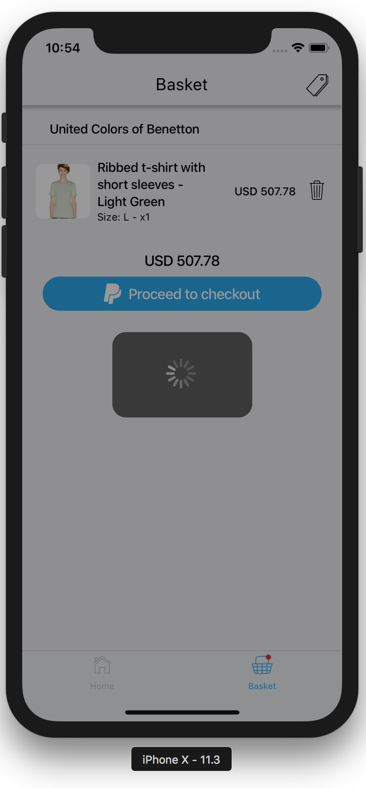
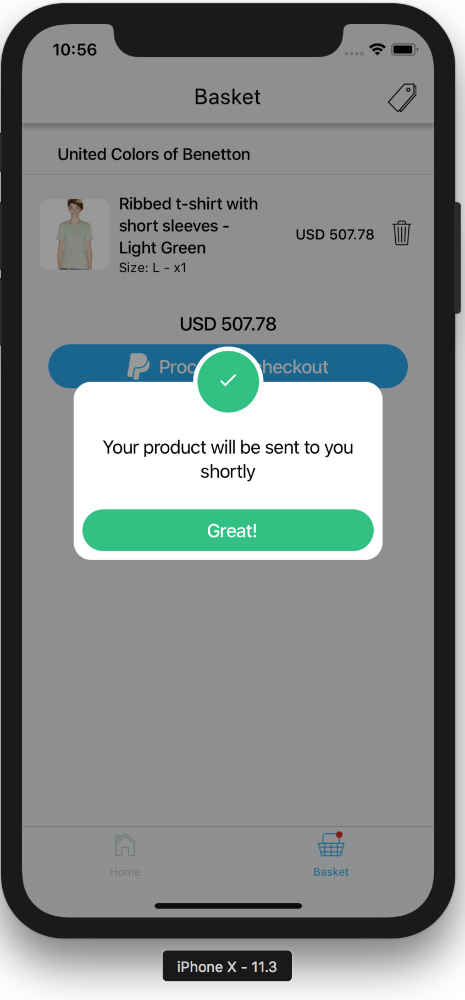
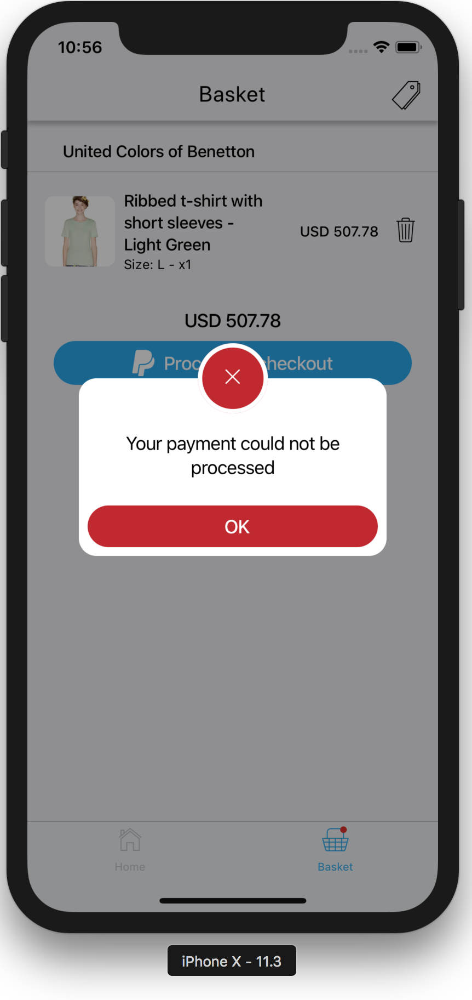

# React Native Fancy Alerts

[![NPM version][npm-image]][npm-url]
[![Downloads][downloads-image]][npm-url]

[npm-image]:http://img.shields.io/npm/v/react-native-expo-fancy-alerts.svg
[npm-url]:https://npmjs.org/package/react-native-expo-fancy-alerts
[downloads-image]:http://img.shields.io/npm/dm/react-native-expo-fancy-alerts.svg

Adaptation of [nativescript-fancyalert](https://github.com/NathanWalker/nativescript-fancyalert) for react native. Compatible with expo 🤓

|  |  |  |
| ---------------------------------------------- | ---------------------------------------------- | ------------------------------------------ |

### Quick Start

```sh
$ npm i react-native-expo-fancy-alerts
```
Or
```sh
$ yarn add react-native-expo-fancy-alerts
```

```javascript
import React from 'react';
import { Text, TouchableOpacity, View } from 'react-native';
import { FancyAlert } from 'react-native-expo-fancy-alerts';

const App = () => {
  const [visible, setVisible] = React.useState(false);
  const toggleAlert = React.useCallback(() => {
    setVisible(!visible);
  }, [visible]);

  return (
    <View>
      <TouchableOpacity onPress={toggleAlert}>
        <Text>Tap me</Text>
      </TouchableOpacity>

      <FancyAlert
        visible={visible}
        icon={<View style={{
          flex: 1,
          display: 'flex',
          justifyContent: 'center',
          alignItems: 'center',
          backgroundColor: 'red',
          borderRadius: 50,
          width: '100%',
        }}><Text>🤓</Text></View>}
        style={{ backgroundColor: 'white' }}
      >
        <Text style={{ marginTop: -16, marginBottom: 32 }}>Hello there</Text>
      </FancyAlert>
    </View>
  )
}

export default App;
```

## Reference

### LoadingIndicator

| Property | Type | Required | Default | Description                                   |
| -------- | ---- | -------- | ------- | --------------------------------------------- |
| visible  | bool | yes      | n/a     | Whether the loading indicator should be shown |

### FancyAlert

| Property       | Type   | Required | Default      | Description                                            |
| -------------- | ------ | -------- | ------------ | ------------------------------------------------------ |
| visible        | bool   | yes      | n/a          | Whether the alert should be visible                    |
| icon           | node   | yes      | n/a          | The icon to show in the alert                          |
| style          | object | no       | `{}`         | Like your usual style prop in any View                 |
| onRequestClose | func   | no       | `() => void` | The action to run when the user taps the button        |

* NOTE -
  Alerts are not dismissed by tapping the blurry background

## Examples

The following example illustrates how you can create a loading indicator for your entire app.
If you're using redux you may have a part of your store which says whether you're loading something,
you can get that flag and show one of the loading indicators offered by this lib.

```javascript
import React from 'react';
import { useSelector } from 'react-redux';
import { LoadingIndicator } from 'react-native-expo-fancy-alerts';
import { selectIsLoading } from 'selectors';

const AppLoadingIndicator = () => {
  const isLoading = useSelector(selectIsLoading);
  return <LoadingIndicator visible={isLoading} />;
}

export default AppLoadingIndicator;
```

This next one is an error message that is also managed globally through redux.

```javascript
import React from 'react';
import { Platform, Text, View, StyleSheet } from 'react-native';
import { useDispatch, useSelector } from 'react-redux';
import { FancyAlert } from 'react-native-expo-fancy-alerts';
import { Ionicons } from '@expo/vector-icons';
import { ErrorCreators } from 'creators';
import { selectError } from 'selectors';

const AppErrorModal = () => {
  const dispatch = useDispatch();
  const { hasError, error } = useSelector(selectError);

  const onRequestClose = React.useCallback(
    () => {
      dispatch(ErrorCreators.hideError());
    },
    [dispatch],
  );

  return <FancyAlert
    style={styles.alert}
    icon={
      <View style={[ styles.icon, { borderRadius: 32 } ]}>
        <Ionicons
          name={Platform.select({ ios: 'ios-close', android: 'md-close' })}
          size={36}
          color="#FFFFFF"
        />
      </View>
    }
    onRequestClose={onRequestClose}
    visible={hasError}
  >
    <View style={styles.content}>
      <Text style={styles.contentText}>{error ? error.message : ''}</Text>

      <TouchableOpacity style={styles.btn} onPress={onPress}>
        <Text style={styles.btnText}>OK</Text>
      </TouchableOpacity>
    </View>
  </FancyAlert>;
}

const styles = StyleSheet.create({
  alert: {
    backgroundColor: '#EEEEEE',
  },
  icon: {
    flex: 1,
    display: 'flex',
    justifyContent: 'center',
    alignItems: 'center',
    backgroundColor: '#C3272B',
    width: '100%',
  },
  content: {
    display: 'flex',
    flexDirection: 'column',
    justifyContent: 'center',
    alignItems: 'center',
    marginTop: -16,
    marginBottom: 16,
  },
  contentText: {
    textAlign: 'center',
  },
  btn: {
    borderRadius: 32,
    display: 'flex',
    flexDirection: 'row',
    justifyContent: 'center',
    alignItems: 'center',
    paddingHorizontal: 8,
    paddingVertical: 8,
    alignSelf: 'stretch',
    backgroundColor: '#4CB748',
    marginTop: 16,
    minWidth: '50%',
    paddingHorizontal: 16,
  },
  btnText: {
    color: '#FFFFFF',
  },
});

export default AppErrorModal;

```

## Changelog

* 0.0.1 - Initial implementation - has layout issues on Android that WILL be fixed
* 0.0.2 - Android issue fixed
* 0.0.3 - Added extra customization options
* 1.0.0 - Years later I decided to package everything and release 🎉🥳
* 2.0.0 - **BREAKING CHANGES** Updated `FancyAlert` to be more intuitive and more generic
* 2.0.1 - Updated docs to include some real-life examples
* 2.0.2 - Updated dependencies
* 2.1.0 - Added typescript typings
